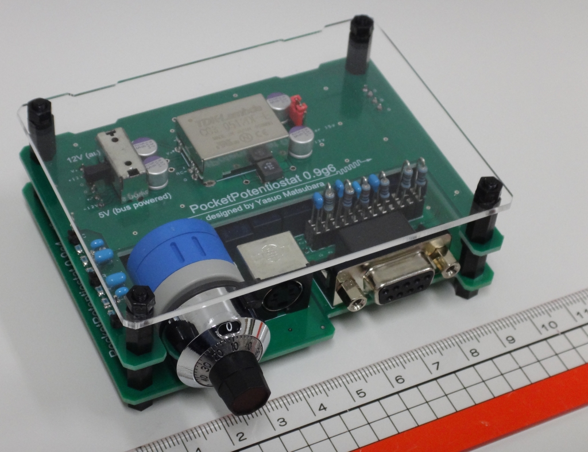

# Voltammogrammer

Voltammogrammer is a software controlling a small yet powerful potentiostat, PocketPotentiostat.

## Features

Using this Voltammogrammer software with the PocketPotentiostat hardware, you can conduct:

- various voltammetric measurements: cyclic voltammetry (CV);  bulk electrolysis (controlled-potential coulometry); linear scan voltammetry (LSV); double-potential-step chronoamperometry; and Osteryoung square-wave voltammetry (OSWV) with or without *i*R potential-drop compensation
- a full-automatic hydrodynamic measurement with an external rotating-disk electrode apparatus (RDE)
- various galvaometric measurements: cyclic galvanometry and constant current
- electrochemical impedance spectroscopy by means of an impedance analyzer 

After these measurements, you can organize acquired data with facility by using functions below. These functions even works without the connection to the PocketPotentiostat hardware!

- overlaid voltammograms with respective styling (color, line style, and line width)
- calculation of a half-wave potential
- data manipulations in terms of current (offset and multiplication for nondimensionalization) and potential (offset for referencing to the potential of a well-known redox couple, e.g., ferrocenium/ferrocene)
- a (gzipped) XML data format for storing organized voltammograms
- decimating data for a presentation-purpose
- graph styling  
- data-import from a BioLogic EC-Lab text file (\*.mpt) and Hokuto text file (\*.txt)

## How to compile

Install Digilent Waveforms SDK 3.10.9 or later version ([**https://reference.digilentinc.com/reference/software/waveforms/waveforms-3/**](https://reference.digilentinc.com/reference/software/waveforms/waveforms-3/)) to a laptop computer running Microsoft Windows operating system. Compile the VisualStudio solution file, `Voltammogrammer.sln` by using the community edition of Microsoft Visual Studio ([**https://visualstudio.microsoft.com/**](https://visualstudio.microsoft.com/)) in the laptop computer. Please note that the solution requires two NuGet libraries as listed in the Dependency section below.

## Basic usage

1. Connect the Analog Discovery 2 (AD2) attached with the device to the laptop computer via a USB cable. If you need to use the voltage regulator (converting of +5 V to ±12 V for the potentiostat), connect an external +5 DCV power supply to the AD2 and switch the regulator on by sliding the switch to the upside (as shown below).
2. Then, launch the software as shown in a screenshot below.
3. Press the `Connect` button to energize the device.

## Detail instructions

## Dependency

This software uses nice NuGet libraries below. Thanks a lot!

-  [aybe / Windows-API-Code-Pack-1.1](https://github.com/aybe/Windows-API-Code-Pack-1.1), a NuGet package for Microsoft Windows API Code Pack for Shell (1.1.1)
-  [Rduto / Microsoft.Solver.Foundation](https://www.nuget.org/packages/Microsoft.Solver.Foundation), a NuGet package for Microsoft Solver Foundation (3.1.0)
-  [ivostoykov /
ProjectBuildCounter ](https://github.com/ivostoykov/ProjectBuildCounter), ProjectBuildCounter for increment of the build
number of C# Visual Studio projects.

## License

GPL-3.0 License (2020, Yasuo Matsubara)
