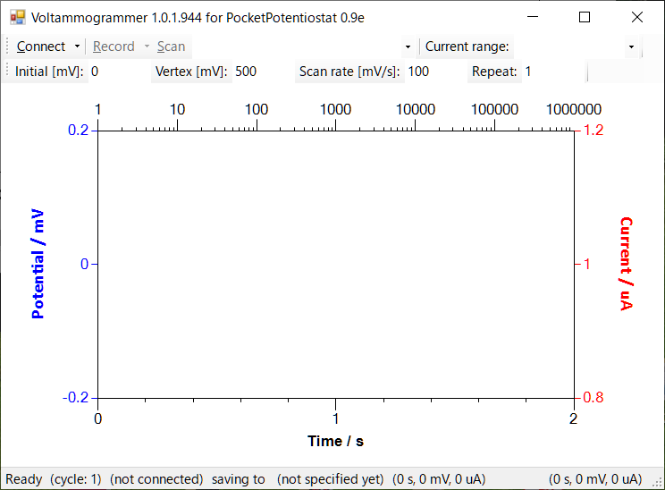
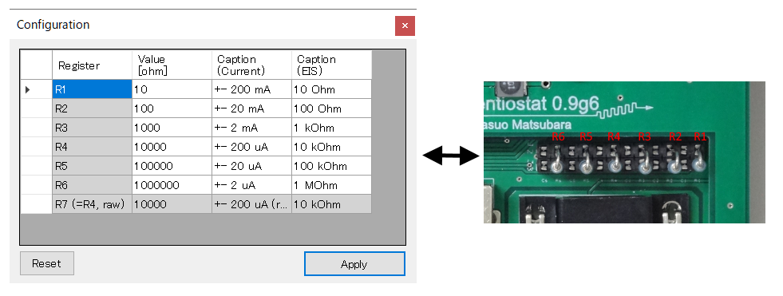

# Voltammogrammer

Voltammogrammer is a software controlling a small yet powerful potentiostat, PocketPotentiostat.

## Features

Using this Voltammogrammer software with the PocketPotentiostat hardware, you can conduct:

- various voltammetric measurements: cyclic voltammetry (CV);  bulk electrolysis (controlled-potential coulometry); linear scan voltammetry (LSV); double-potential-step chronoamperometry; and Osteryoung square-wave voltammetry (OSWV) with or without *i*R potential-drop compensation, where a digital first-order sinc filter (sinc^1^) can attenuate noise from power line (50 or 60 Hz)
- a full-automatic hydrodynamic measurement with an external rotating-disk electrode apparatus (RDE)
- various galvaometric measurements: cyclic galvanometry and constant current
- electrochemical impedance spectroscopy by means of an impedance analyzer 
- recording open-circuit potential
- ultralow-current measurement (in pA scale) with an appropriate reference resistor

After these measurements, you can organize acquired data with facility by using functions below. These functions even works without the connection to the PocketPotentiostat hardware!

- overlaid voltammograms with respective styling (color, line style, and line width)
- calculation of a half-wave potential
- data manipulations in terms of current (offset and multiplication for nondimensionalization) and potential (offset for referencing to the potential of a well-known redox couple, e.g., ferrocenium/ferrocene)
- a (gzipped) XML data format for storing organized voltammograms (*.volta or *.voltax )
- decimating data for a presentation-purpose
- graph styling  
- data-import from a BioLogic EC-Lab text file (\*.mpt) and Hokuto text file (\*.txt)

## How to compile

Install Digilent Waveforms SDK 3.10.9 or later version ([**https://reference.digilentinc.com/reference/software/waveforms/waveforms-3/**](https://reference.digilentinc.com/reference/software/waveforms/waveforms-3/)) to a laptop computer running Microsoft Windows operating system. Compile the VisualStudio solution file, `Voltammogrammer.sln` by using the community edition of Microsoft Visual Studio ([**https://visualstudio.microsoft.com/**](https://visualstudio.microsoft.com/)) in the laptop computer. Please note that the solution requires two NuGet libraries as listed in the Dependency section below.

## Basic usage

1. Connect the Analog Discovery 2 (AD2) attached with the device to the laptop computer via a USB cable. If you need to use the voltage regulator (converting of +5 V to ±12 V for the potentiostat), connect an external +5 DCV power supply to the AD2 and switch the regulator on by sliding the switch to the upside (as shown below).

   

2. Then, launch the software as shown in a screenshot below.

   

3. Press the `Connect` button to energize the device. If multiple AD2s are connected to the computer, select a target device from the pull-down list (in the drop-down menu from the `Connect` button) enumerating device IDs of AD2s.

4. Configure values of reference resistor in the "Configure_Potentiostat" sub-window (invoked by `Record` > `Configure Potentiostat...` menu) in order to match up these values with those of actual resistors inserted in the device *a priori*. This configuration is essential for an internal *I*-*V* converter in the device. For example, a resistor of 10 MΩ is required to sense a current in a few nA scale with the device. 

5. Select "Cyclic Voltammetry" as a `technique`, "+-200 uA" as a `current range` from combo boxes. When you select the current range, mechanical relay-switches in the device turn on an analog circuit to use the target reference resistor from a set of resistors (10 kΩ in this case) for an internal *I*-*V* converter in the device. Set "-300", "500", "100", and "1" to text boxes of the `initial` potential, `vertex` potential, `scanning rate`, and `repeat` count, respectively, for the measurement of cyclic voltammetry.

6. Connect cable terminals (*i.e.*, tricolored alligator clips from the PocketPotentiostat device) to a three-electrode electrochemical cell consisting of working, counter, and reference electrodes. The cell also holds a solution of interest. As an example, we assume that a tetrahydrofuran solution containing ferrocene (1 mM) and tetrabutylammonium hexafluorophosphate (0.1 M) is tested. 

7. Click `Record` button to start recording the cyclic voltammogram with storing data in the file you asked beforehand (if not necessary, click `Scan` to do it without saving). 

8. During the recording, you can stop the recording at any time by clicking `Stop` button.

9. After the recording, you should see two temporal response-curves of current (red line) and potential (blue line) as shown below. First two seconds in these responses correspond the duration for pre-electrolysis at the `initial` potential to attenuate a (non-Faradaic) charging current. Then, the triangle-shaped potential waveform (blue line) was input to the device that outputting a potential waveform from which the Faradaic current response (red line) was calculated according to Ohm's law with the reference resistor selected. 

10. Meanwhile, the actual cyclic voltammogram appears in the "Actual Voltammogram" window. In this window, you can organize a set of voltammograms with facility.

11. As shown in a screenshot below, the window consists of three toolbars with the main menu. By using the appearance toolbar, you can change the appearance of respective voltammogram (line color, line style, and line width). By using the mathematics toolbar, you can manipulate a voltammogram in terms of current (with text boxes of `+I`  for offset and `xI` for multiplication) and potential (with a text box of `Fc(+/0)` for offset). Note that the mathematical manipulation-history is noted in the graph legend. By using the axes toolbar, you can change units for horizontal and vertical axes. By using the "Half-wave potential" sub-window (invoked by `Calculation` > `Half-wave potential...` menu), you can semi-automatically calculate the half-wave potential of a cyclic voltammogram acquired. 
    

12. Finally, such organized voltammogramms can be saved to the file you specified by clicking `Save As` menu in the main toolbar. In the dialogue box, you can also specify whether or not to decimate the raw data points of voltammograms.

## Dependency

This software uses nice NuGet libraries below. Thanks a lot!

-  [aybe / Windows-API-Code-Pack-1.1](https://github.com/aybe/Windows-API-Code-Pack-1.1), a NuGet package for Microsoft Windows API Code Pack for Shell (1.1.1)
-  [Rduto / Microsoft.Solver.Foundation](https://www.nuget.org/packages/Microsoft.Solver.Foundation), a NuGet package for Microsoft Solver Foundation (3.1.0)
-  [ivostoykov /
ProjectBuildCounter ](https://github.com/ivostoykov/ProjectBuildCounter), ProjectBuildCounter for increment of the build
number of C# Visual Studio projects.

## License

GPL-3.0 License (2020, Yasuo Matsubara)
